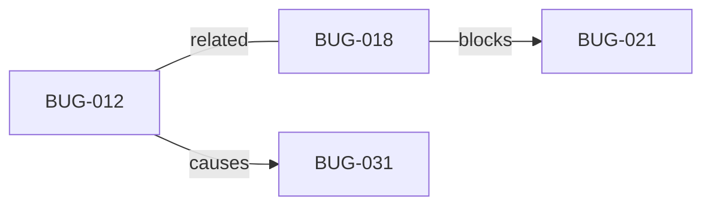

# Conversa: Documentação e Rastreabilidade de Bugs para Agentes LLM

**Contexto:** Discussão entre Sandeco e ChatGPT sobre uma arquitetura de
documentação de bugs orientada a Codex, Claude Code, SDD e agentes do
Reversa.

------------------------------------------------------------------------

## Sandeco

Qual a melhor forma de documentar bugs para que as LLMs no Codex e
Claude Code possam documentar e/ou depois corrigir? Quero estrutura de
pastas, nome de arquivos e etc.

------------------------------------------------------------------------

## ChatGPT

Sandeco, para **Codex + Claude Code**, eu faria um sistema de bugs
**dentro do próprio repositório, orientado a arquivos Markdown e
explicitamente projetado para agentes**.

Minha recomendação:

``` text
project/
│
├── AGENTS.md
├── CLAUDE.md
│
├── bugs/
│   ├── README.md
│   ├── index.md
│   │
│   ├── open/
│   │   ├── BUG-001-login-timeout.md
│   │   ├── BUG-002-video-black-screen.md
│   │   └── BUG-003-invalid-cache.md
│   │
│   ├── investigating/
│   │   └── BUG-004-memory-leak.md
│   │
│   ├── resolved/
│   │   └── BUG-005-token-refresh.md
│   │
│   └── templates/
│       └── bug-template.md
│
└── src/
```

## Eu chamaria simplesmente de `/bugs`

Não usaria:

``` text
docs/bugs/
issues/
problems/
errors/
```

Para agente, **semântica explícita vence elegância arquitetural**.

``` text
bugs/
```

é impossível de interpretar errado.

## O arquivo de bug

Eu criaria **um bug por arquivo**.

Exemplo:

``` text
BUG-002-video-black-screen.md
```

Conteúdo:

``` markdown
---
id: BUG-002
title: Tela preta ao iniciar vídeo
status: open
severity: high
priority: P1
created: 2026-07-13
updated: 2026-07-13
component: video-player
reproducible: always
---

# Tela preta ao iniciar vídeo

## Summary

O player exibe uma tela preta quando o vídeo é iniciado pela primeira vez.

## Expected Behavior

O primeiro frame do vídeo deve ser renderizado imediatamente após o carregamento.

## Actual Behavior

O player permanece preto.

O áudio é reproduzido normalmente.

## Steps to Reproduce

1. Iniciar a aplicação.
2. Abrir um projeto existente.
3. Selecionar um vídeo MP4.
4. Pressionar Play.

## Reproduction Rate

10/10

## Environment

- OS: Windows 11
- Browser: Chrome 140
- GPU: RTX 4070
- Application version: 0.8.2

## Evidence

- Console error: `VideoFrame is undefined`
- Screenshot: `evidence/BUG-002/black-screen.png`
- Log: `evidence/BUG-002/console.log`

## Suspected Area

Possivelmente relacionado a:

- `src/video/player.ts`
- `src/video/renderer.ts`

Suspeita inicial: inicialização do renderer ocorre antes da disponibilidade do primeiro frame.

## Acceptance Criteria

- O primeiro frame deve aparecer antes da reprodução.
- O vídeo não deve apresentar tela preta.
- O áudio e vídeo devem permanecer sincronizados.
- Os testes existentes devem continuar passando.

## Verification

Executar:

```bash
pytest
npm run test
npm run lint
```

Realizar também o fluxo manual descrito em `Steps to Reproduce`.

## Resolution

Not resolved.

## Agent Notes

Não alterar o pipeline de áudio.

Evitar refatoração ampla do player durante a correção deste bug.


    ## A parte mais importante: YAML front matter

    Isto:

    ```yaml
    ---
    id: BUG-002
    title: Tela preta ao iniciar vídeo
    status: open
    severity: high
    priority: P1
    created: 2026-07-13
    updated: 2026-07-13
    component: video-player
    reproducible: always
    ---

é **ouro para LLM**.

Você consegue mandar:

> Corrija todos os bugs P1 abertos.

O agente pode procurar:

``` yaml
status: open
priority: P1
```

Ou:

> Analise todos os bugs relacionados ao video-player.

Ele procura:

``` yaml
component: video-player
```

Isso torna o seu sistema quase um **banco de dados baseado em
Markdown**.

## Status controlado

Eu usaria **somente quatro estados**:

``` text
open
investigating
blocked
resolved
```

Nada de:

``` text
doing
todo
done
working
fixing
analysis
in-progress
```

Quanto menor a ontologia, melhor para o agente.

Pastas:

``` text
bugs/open/
bugs/investigating/
bugs/blocked/
bugs/resolved/
```

E o `status` precisa acompanhar a pasta.

## Prioridade e severidade são coisas diferentes

Eu manteria as duas.

  Campo        Significado
  ------------ ----------------------
  `severity`   tamanho do estrago
  `priority`   urgência de correção

### Severidade

``` text
critical
high
medium
low
```

### Prioridade

``` text
P0
P1
P2
P3
```

## Evidências devem ficar separadas

``` text
bugs/
├── evidence/
│   ├── BUG-001/
│   │   ├── screenshot.png
│   │   ├── console.log
│   │   └── network.json
│   │
│   └── BUG-002/
│       ├── black-screen.png
│       └── reproduction.mp4
```

**Não enfie logs gigantes dentro do Markdown.**

## O `bugs/index.md`

Eu manteria um índice **gerado automaticamente**.

``` markdown
# Bug Index

Last updated: 2026-07-13

## Summary

| Status | Count |
|---|---:|
| Open | 7 |
| Investigating | 2 |
| Blocked | 1 |
| Resolved | 14 |

## Open Bugs

| ID | Priority | Severity | Component | Title |
|---|---|---|---|---|
| BUG-001 | P0 | high | auth | Login timeout |
| BUG-002 | P1 | high | video-player | Black screen |
| BUG-003 | P2 | medium | cache | Invalid cache |
```

`index.md` não é source of truth. O source of truth é cada `BUG-XXX.md`.

## `bugs/README.md`

O README define o registro canônico, lifecycle, regras dos agentes,
protocolo de resolução e convenção de nomes.

## Codex e Claude Code

No `AGENTS.md`, definir que o registro canônico está em `/bugs`, exigir
leitura do `bugs/README.md`, reprodução do defeito, identificação da
causa raiz, teste de regressão, menor correção coerente e atualização do
documento.

No `CLAUDE.md`, definir o mesmo protocolo e impedir que um bug seja
marcado como resolvido sem causa raiz, teste quando tecnicamente
possível, verificação e critérios de aceitação satisfeitos.

## Dois workflows

``` text
/bug
/fix-bug
```

Conceitualmente:

``` text
/bug
    ↓
investiga a descrição do usuário
    ↓
procura duplicata
    ↓
coleta evidências
    ↓
cria BUG-XXX.md
    ↓
NÃO CORRIGE
```

E:

``` text
/fix-bug BUG-002
    ↓
lê bug
    ↓
reproduz
    ↓
identifica root cause
    ↓
cria regression test
    ↓
corrige
    ↓
verifica
    ↓
documenta resolução
    ↓
move para resolved
```

**Separaria brutalmente `documentar bug` de `corrigir bug`.**

------------------------------------------------------------------------

## Sandeco

E como organizar por feature, ou subsistema ou módulo etc? Qual a melhor
forma?

------------------------------------------------------------------------

## ChatGPT

**Eu não organizaria a pasta física por feature, módulo ou subsistema.**

Minha recomendação é:

> **status na estrutura de pastas; domínio técnico nos metadados.**

``` text
bugs/
├── open/
├── investigating/
├── blocked/
└── resolved/
```

No bug:

``` yaml
---
id: BUG-042
title: Timeline perde sincronismo após seek
status: open
priority: P1
severity: high

system: editor
subsystem: timeline
module: playback
feature: seek
component: video-sync

labels:
  - video
  - synchronization
  - regression
---
```

A hierarquia inicialmente proposta foi:

``` text
system
  └── subsystem
        └── module
              └── feature
                    └── component
```

Mas bugs frequentemente atravessam múltiplos módulos. Além disso, o
diagnóstico pode mudar. Por isso, a classificação arquitetural deve
permanecer em metadados, e não determinar a localização física do
arquivo.

## Separar `affected` de `root_cause`

Antes da investigação:

``` yaml
affected:
  systems:
    - editor
  subsystems:
    - timeline
  modules:
    - playback
```

Depois:

``` yaml
root_cause:
  system: rendering
  subsystem: frame-pipeline
  module: frame-buffer
  component: frame-cache
```

Existe uma diferença fundamental entre **onde o bug aparece** e **onde o
bug nasceu**.

## Catálogo de arquitetura

Foi sugerido um `bugs/taxonomy.yaml` para impedir que agentes inventem
nomes inconsistentes de sistemas, módulos e features.

Regra:

``` markdown
Architecture classification fields MUST use values defined in
`bugs/taxonomy.yaml`.

Do not invent new system, subsystem, module, feature, or component names.

If no existing classification is appropriate, use `unclassified` and document
the proposed taxonomy change in Agent Notes.
```

------------------------------------------------------------------------

## Sandeco

Mas a gente tem que ter cuidado para nao ficar uma árvore muito grande
de pastas.

------------------------------------------------------------------------

## ChatGPT

Exatamente. **Eu reduziria bastante.**

Para LLM, árvore profunda costuma piorar navegação, aumentar ambiguidade
e exigir mais buscas. Eu usaria no máximo **2 níveis úteis**.

``` text
bugs/
├── README.md
├── taxonomy.yaml
├── open/
├── active/
├── resolved/
└── evidence/
```

Só isso.

Os bugs:

``` text
bugs/open/BUG-042-timeline-desync.md
bugs/open/BUG-043-export-crash.md
bugs/active/BUG-018-memory-leak.md
```

A organização por feature, módulo ou subsistema fica **inteiramente no
front matter**:

``` yaml
---
id: BUG-042
status: open

area: editor
module: timeline
feature: seek

priority: P1
severity: high
---
```

## Ontologia simplificada

  Campo       Função
  ----------- -------------------------
  `area`      grande área do produto
  `module`    parte técnica principal
  `feature`   funcionalidade afetada

Exemplo:

``` yaml
area: rendering
module: animated-typing
feature: cursor
```

Para bugs transversais:

``` yaml
areas:
  - editor
  - rendering

modules:
  - timeline
  - frame-buffer

feature: seek
```

A recomendação consolidada foi:

``` text
bugs/
├── README.md
├── taxonomy.yaml
├── open/
├── active/
├── resolved/
└── evidence/
```

Com classificação:

``` yaml
area:
module:
feature:
```

**Status é navegação; arquitetura é metadata.**

------------------------------------------------------------------------

## Sandeco

Ah, e todo bug deve ser rastreavel ligando o codigo ou códigos
(arquivos) as specs

------------------------------------------------------------------------

## ChatGPT

**Isso muda a arquitetura do bug tracking.** O bug não deve ser só um
relato de defeito. Ele deve funcionar como um **nó de rastreabilidade
entre SPEC ↔ código ↔ teste ↔ correção**.

``` text
SPEC
  ↓
CODE
  ↓
BUG
  ↓
FIX
  ↓
TEST
```

Com links bidirecionais sempre que possível.

## Estrutura do bug

``` yaml
---
id: BUG-042
title: Timeline perde sincronismo após seek
status: open

area: editor
module: timeline
feature: seek

priority: P1
severity: high

specs:
  - specs/editor/timeline.md#seek
  - specs/rendering/frame-pipeline.md#frame-synchronization

code:
  - src/editor/timeline/seek.ts
  - src/rendering/frame-buffer.ts

tests:
  - tests/editor/timeline/seek.test.ts

introduced_by: unknown
fixed_by: null
---
```

A ideia central:

``` text
BUG-042
│
├── specs[]
├── code[]
└── tests[]
```

**Sempre plural.**

## Seção explícita de rastreabilidade

``` markdown
## Traceability

### Specifications

- `specs/editor/timeline.md#seek`
- `specs/rendering/frame-pipeline.md#frame-synchronization`

### Affected Code

- `src/editor/timeline/seek.ts`
- `src/rendering/frame-buffer.ts`

### Tests

- `tests/editor/timeline/seek.test.ts`

### Trace

`timeline.md#seek`
→ `seek.ts`
→ `frame-buffer.ts`
→ `seek.test.ts`
```

Não é apenas uma lista de arquivos. É a **cadeia causal esperada**.

## Código afetado versus causa raiz

Antes:

``` yaml
affected_code:
  - src/editor/timeline/seek.ts
  - src/rendering/frame-buffer.ts

root_cause_code: []
```

Depois:

``` yaml
affected_code:
  - src/editor/timeline/seek.ts

root_cause_code:
  - src/rendering/frame-buffer.ts
```

Formato recomendado:

``` yaml
traceability:
  specs:
    - specs/editor/timeline.md#seek

  affected_code:
    - src/editor/timeline/seek.ts

  root_cause_code:
    - src/rendering/frame-buffer.ts

  regression_tests:
    - tests/editor/timeline/seek.test.ts
```

## Regra dura no `bugs/README.md`

``` markdown
## Traceability Rule

Every bug MUST be traceable to the project specification and source code.

A bug record MUST identify:

1. The specification section defining the expected behavior.
2. The source code affected by the defect.
3. The root cause code, once identified.
4. The regression tests used to verify the fix.

A bug MUST NOT be marked as resolved if `traceability.specs`,
`traceability.root_cause_code`, or `traceability.regression_tests`
are empty.

If no specification exists for the affected behavior, the bug MUST be marked
as `spec-gap` and the missing specification must be created or updated before
resolution.
```

A sacada é o `spec-gap`.

Se o agente encontra um bug e não consegue ligá-lo a uma SPEC:

``` yaml
labels:
  - spec-gap
```

Surge a pergunta:

> **É um bug ou o comportamento nunca foi especificado?**

Um bug só pode ser `resolved` quando fechar o quadrado de
rastreabilidade:

``` text
┌──────── SPEC ────────┐
│                      │
CODE                  BUG
│                      │
└──────── TEST ────────┘
```

**SPEC define. Código implementa. Bug denuncia a divergência. Teste
prova que a divergência foi eliminada.**

------------------------------------------------------------------------

## Sandeco

Eu acho importante uma matriz de rastrabilidade entre bugs, uma matriz
que mostraria a relação entre os bugs. Faz sentido?

------------------------------------------------------------------------

## ChatGPT

Faz **muito sentido**. Ela pode ser ainda mais valiosa para LLMs do que
para humanos.

A ideia é representar que bugs podem estar:

``` text
BUG-012 ── causa ───────► BUG-031
BUG-018 ── relacionado ──► BUG-024
BUG-021 ── bloqueia ─────► BUG-022
BUG-040 ── duplica ──────► BUG-017
BUG-052 ── regressão de ─► BUG-009
```

Isso impede o agente de tratar cada bug como uma ilha.

## Relações tipadas

Não apenas:

``` yaml
related_bugs:
  - BUG-012
  - BUG-031
```

Mas:

``` yaml
relationships:
  - bug: BUG-012
    type: caused-by

  - bug: BUG-031
    type: blocks

  - bug: BUG-009
    type: regression-of
```

Ontologia pequena:

  Relação            Significado
  ------------------ ---------------------------------------
  `related-to`       relação genérica
  `caused-by`        causado por outro bug
  `causes`           causa outro bug
  `blocks`           impede a correção
  `blocked-by`       depende de outro bug
  `duplicate-of`     duplicata
  `regression-of`    comportamento voltou
  `conflicts-with`   correções potencialmente conflitantes

## A matriz

Arquivo:

``` text
bugs/relationships.md
```

Exemplo:

  Bug           BUG-012     BUG-018      BUG-021   BUG-031
  ------------- ----------- ------------ --------- ---------
  **BUG-012**   ---         related      ---       causes
  **BUG-018**   related     ---          blocks    ---
  **BUG-021**   ---         blocked-by   ---       ---
  **BUG-031**   caused-by   ---          ---       ---

A matriz **não deve ser source of truth**.

O source of truth continua sendo cada `BUG-XXX.md`.

A matriz deve ser gerada automaticamente:

``` text
BUG files
    ↓
parser
    ↓
relationships.md
```

## Duas views

``` text
bugs/
├── matrix.md
└── graph.md
```

### `matrix.md`

Boa para comparação sistemática.

### `graph.md`

Mermaid:



O grafo pode permitir que uma LLM perceba clusters.

Exemplo:

``` text
BUG-012
   │
   ├── causes BUG-031
   ├── causes BUG-044
   └── related BUG-018
```

Conclusão possível:

> "Não faz sentido corrigir BUG-031 e BUG-044 isoladamente. BUG-012
> parece ser o defeito estrutural."

## Bug Impact Score

Exemplo conceitual:

``` text
impact =
  bugs_caused * 3
+ bugs_blocked * 2
+ regressions * 4
+ related_bugs
```

Um agente poderia receber:

> Corrija o bug aberto com maior impacto sistêmico.

Isso é mais inteligente do que simplesmente corrigir o P1 mais antigo.

## Estrutura consolidada

``` text
bugs/
├── README.md
├── taxonomy.yaml
├── matrix.md
├── graph.md
├── open/
├── active/
├── resolved/
└── evidence/
```

Cada bug:

``` yaml
---
id: BUG-042
status: open

area: editor
module: timeline
feature: seek

relationships:
  - bug: BUG-018
    type: caused-by

  - bug: BUG-051
    type: blocks

  - bug: BUG-009
    type: regression-of

traceability:
  specs:
    - specs/editor/timeline.md#seek

  affected_code:
    - src/editor/timeline/seek.ts

  root_cause_code: []

  regression_tests: []
---
```

A rastreabilidade foi organizada em três dimensões:

``` text
1. VERTICAL
SPEC ↔ CODE ↔ TEST ↔ BUG

2. HORIZONTAL
BUG ↔ BUG

3. TEMPORAL
BUG → FIX → REGRESSION
```

Isso cria quase um **knowledge graph de defeitos do software**.

A documentação de bugs passa a funcionar como uma **memória causal de
falhas para agentes de software**.

------------------------------------------------------------------------

## Sandeco

Poderia ser agentes do Reversa não é?

------------------------------------------------------------------------

## ChatGPT

**Exatamente. E isso encaixa melhor no Reversa do que como um sistema
isolado.**

O Reversa já faz:

``` text
CODE → SPEC
```

Os agentes de bugs poderiam ampliar para:

``` text
          ┌── BUG ──┐
          │         │
CODE ──► SPEC ◄──► TEST
  ▲       │         │
  └──── ROOT CAUSE ─┘
```

Agentes especializados:

  Agente                 Função
  ---------------------- ---------------------------------------------
  **Bug Registrar**      transforma relato/evidência em `BUG-XXX.md`
  **Bug Tracer**         liga BUG ↔ SPEC ↔ CODE ↔ TEST
  **Bug Correlator**     encontra relações BUG ↔ BUG
  **Root Cause Agent**   investiga causa raiz
  **Spec Gap Agent**     detecta comportamento sem SPEC
  **Bug Graph Agent**    gera matriz, grafo e clusters
  **Bug Prioritizer**    calcula impacto sistêmico

A parte especialmente interessante é o `Bug Correlator`.

Ele poderia ler todos os bugs e descobrir:

``` text
BUG-012 → frame-buffer
BUG-031 → frame-buffer
BUG-044 → frame-buffer
BUG-052 → frame-buffer
```

E concluir:

> "Quatro bugs aparentemente distintos convergem para o mesmo componente
> e para a mesma cadeia de SPECs. Há evidência de uma causa estrutural
> comum."

Isso é **engenharia reversa da falha**.

No Reversa, poderia existir conceitualmente:

``` text
/reversa-bug
/reversa-bug-trace
/reversa-bug-correlate
/reversa-bug-graph
```

Ou um único comando:

``` text
/reversa-bug
```

com um **loop multiagente interno**.

A feature central identificada foi:

> **O Reversa não apenas reconstrói a intenção do software pelo código.
> Ele pode reconstruir a topologia causal das falhas.**

------------------------------------------------------------------------

# Síntese conceitual consolidada

A proposta evoluiu de um simples diretório `/bugs` para uma arquitetura
de **memória causal de defeitos orientada a agentes**.

## Estrutura rasa

``` text
bugs/
├── README.md
├── taxonomy.yaml
├── matrix.md
├── graph.md
├── open/
├── active/
├── resolved/
└── evidence/
```

## Organização

-   **Status** determina a pasta.
-   **Área, módulo e feature** ficam em metadados.
-   Cada bug é um arquivo Markdown independente.
-   O YAML front matter permite busca e processamento determinístico.
-   O arquivo do bug é o source of truth.
-   Índices, matrizes e grafos são views geradas.

## Três dimensões de rastreabilidade

``` text
VERTICAL:   SPEC ↔ CODE ↔ TEST ↔ BUG
HORIZONTAL: BUG ↔ BUG
TEMPORAL:   BUG → FIX → REGRESSION
```

## Papel do Reversa

``` text
CODE → SPEC
```

e, com os agentes de bugs:

``` text
CODE ↔ SPEC ↔ BUG ↔ TEST ↔ ROOT CAUSE
```

O resultado conceitual é uma **topologia causal das falhas do
software**, mantida e explorada por agentes especializados do Reversa.
